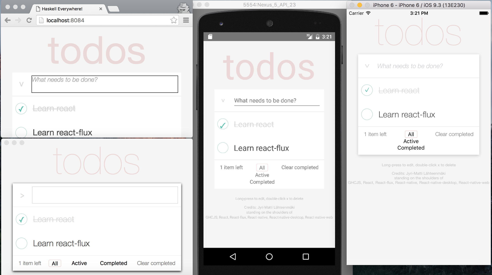

===================
Haskell Everywhere!
===================

Exploring the design space of how to use Haskell in different environments.
This project is a work-in-progress and meant to be a template or an example for "real" applications.

Steps
-----

- *copy-paste a simple example app from https://hackage.haskell.org/package/react-flux*
- *make run in web browser*
- *make run as GTK app (not done since couldn't get webkit to compile under osx)*
- *wrap with `react-native <https://facebook.github.io/react-native/>`_*
- *curse `NPM <https://www.npmjs.com/>`_*
- *make run in iOS simulator*
- *include https://github.com/necolas/react-native-web to make run in browser again*
- *make run in Android emulator*
- *make Live Reload work in all envs*
- *write a README*
- *cleanup and upload to github*
- *make run in OSX with https://github.com/ptmt/react-native-desktop*
- *try to convert the example todo app from the react-flux project to react-native to see if react-native falls short*
- *create scripts for easy packaging*
- *publish example apps to internet (except for ios...)*
- make GHCJSi REPL work
- make run in actual iPhone and Android phone
- submit to App Store and Google Play
- finish todo app to work perfectly in all platforms
- include some webview-sub-app as part of the native app
- try to use some native component not yet in react-native
- make run in windows with https://github.com/ReactWindows/react-native
- profit? nah...

I just wanna try the example app!
---------------------------------

Available in:

http://lahteenmaki.net/hsEverywhere.html

http://lahteenmaki.net/hsEverywhere.dmg

http://lahteenmaki.net/hsEverywhere.apk

If you don't trust me (and you shouldn't!), just follow the instructions to build on your own machine.

Installation
------------

1. install `Nix <http://nixos.org/nixpkgs/>`_. You should already have it.
2. install XCode and some Android emulator depending on your needs.
3. ``git clone https://github.com/jyrimatti/hseverywhere``
4. Execute ``init.sh`` to download and install half the Internet. Just answer 'yes' or 'y' to possible questions.

Tested in OSX and Nixpkgs revision ``3e750abb0c3e5019651b5f11ece7300c1b548d04``. More recent Nixpkgs revisions will also probably work.

I tried to keep everything deterministic and from messing with your global environment, but I'm no expert with NPM. Pull requests are appreciated.

Installation creates a subdirectory containing all the react-native stuff.
This directory is for now completely generated (unless You modify it somehow yourself), so if you think you've messed up something or want to update js-dependencies, just rm -R the generated directory and re-run init.sh.

Running
-------

- >>> ./run-in-web.sh
- >>> ./run-in-ios.sh
- >>> ./run-in-android.sh
- >>> ./run-in-osx.sh

Browser and iOS simulator open automatically.
Android emulator needs to be running in advance.
OSX opens XCode, in which you have to 'Run' the app (can this be done from the command line?).

All can be run simultaneously.
Default port choices can be changed (except for Android) by giving new port as an argument, e.g.

- >>> ./run-in-osx.sh 8191

If Android emulator complains about HAX etc, check you don't have any VirtualBoxes running.

Haskell development
-------------------

>>> nix-shell

Now you are inside a Nix shell with the required Haskell dependencies globally installed. Use cabal and pile up your haskell environment, e.g.

>>> nix-shell -p haskellPackages.stylish-haskell -p haskellPackages.hdevtools -p haskellPackages.apply-refact -p haskellPackages.pointfree

New Haskell-dependencies should be added to both cabal file and default.nix. Then rerun nix-shell.

iOS/Android/OSX development
---------------------------

I have no idea, never done those. I think you can just develop the projects created by react-native, but note that at least for now, this repo has added the whole react-native-subproject to .gitignore.

Continuous Compilation
----------------------

>>> ./cc.sh

Feedback cycle is still quite poor.
If I have all 4 platforms running and save a change in Haskell code,
after about 45 seconds I see the effect in all platforms (and osx needs a manual reload).
Could be worse, though.

Live reload
-----------

Whenever Haskell code compiles, the app should automatically reload itself. No manual refresh (CMD+r/double-r) should be necessary, except in OSX.

``run-in-web.sh`` starts webpack-dev-server which automatically reloads the app.

In iOS simulator enable "Live Reload" in shake-gesture menu.

In Android emulator enable "Live Reload" in shake-gesture menu (F2).

Repl
----

- >>> ./cc.sh
- >>> ./run-in-<platform>.sh
- >>> ./repl.sh

I'm not sure if this works, but atleast it seems to be able connect from all platforms.
Always hooked to port 8080 for now, so can only be used with one platform at a time.
How can I pass a port from shell scripts to the actual runtime?

Note that cc.sh contains a hack to modify the generated js file, so a regular cabal-build will not work here.

Packaging
---------

- >>> ./package-web.sh
- >>> ./package-android.sh
- >>> ./package-osx.sh

Problems
--------

- some styling inconsistencies between ios and android
- react-flux does not support all kinds of properties (https://bitbucket.org/wuzzeb/react-flux/issues/10/)
- react-native-desktop is still work-in-progress
  - needs message for alert although should be optional
  - text-input is always multiline
  - text-input seems to fire onBlur after half-a-second its activation
  - rotation-transformation does not seem to work
- react-native-web is still work-in-progress
  - no support for ListView
  - no support for Linking API
  - TextInput does not support submitting
  - text components collapse together (maybe a missing white-space: pre; ?)
